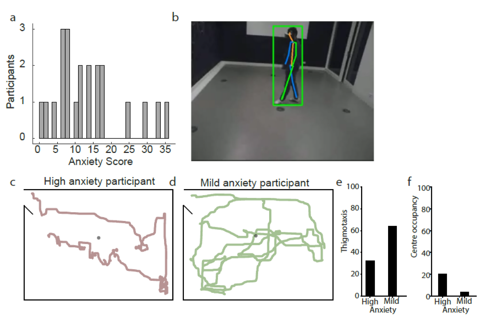

# Disrupting Reality - A new conceptual architecture for experiments in transcendental phenomenology.
*Project under development*

## Introduction

This project presents a novel approach to overcoming the traditional dichotomy between transcendental phenomenology and experimental framing. The challenge lies in the ontologically dichotomous foundations of the two methodologies. Most experimental investigations are rooted in a Cartesian/Kantian dualist ontology where a detached subject cognizes an external object. On the other hand, transcendental phenomenology strives to resolve this dualism, considering both subject and object as parts of a continuous flow of experience.

## Approach

Our approach involves reconsidering the ontological basis of experiments, reimagining their design, methodology, setting, and the analysis and interpretation of findings. We strive to align these elements closer to phenomenology, while still remaining compatible with empirical measurements.

We've found that artistic experiences serve as a viable middle ground. They're infused with key principles of transcendental phenomenology, including meaning formation, intentionality, and responsiveness.

## Pilot Experiment: Human Open Field

To assess our approach, we designed a pilot experimental setting, the Human Open Field, which symbolically reveals how subjects form meaning as they traverse various modes of intentional behaviour.

The experiment began with subjects experiencing a novel, unstructured environment while their perceptions were altered using extended reality goggles. The primary goal was to observe the impact of these novel experiences on the subjects' meaning-making process.

Observations were made via objective measurements such as position tracking and EEG, as well as phenomenological interviewing methods. This dual approach allowed us to collect phenomenologically rich data that's also compatible with scientific measurements.

  
   
  <em>Figure: Visualization behavior quantification in Human Open Field. (a) Distribution of Beck Anxiety Inventory scores (b) Deep learning-based pose estimation of natural behavior (c-d) Top-down tracking of participants as they move through the Open Field (Left: high anxiety participant; right: mild anxiety participant) (e-f) Thigmotaxis (wall nearness) and center occupancy for the visualized participants.</em>

<!-- 

(a) Distribution of Beck Anxiety Inventory scores
(b) Deep learning-based pose estimation of natural behavior
(c-d) Top-down tracking of participants as they move through the Open Field (Left: high anxiety participant; right: mild anxiety participant)
(e-f) Thigmotaxis (wall nearness) and center occupancy for the visualized participants. -->

## Conclusion

Our pilot experiment marks the beginning of a principled exploration into how we can design experimental settings that can inform transcendental thinking and gather rich data compatible with scientific measurements. We aim to better understand the conditions under which meaning is formed and how it evolves.

We welcome collaboration and discussion from those interested in furthering this intersection of transcendental phenomenology and experimental methodologies.

## Misc
This repository contains scripts and results related to computer vision analyses for each camera used in open-field tracking experiments for studying the phenomenology of human behavior in virtual reality. Specifically, the repository includes scripts and results for the top-down camera and the side-view camera.

### Top-Down Camera
The top-down camera is used for person detection and subsequent kinematic analyses, including thigmotaxis and velocity tracking. The scripts included in this folder allow for the automated detection and tracking of individuals in the virtual reality environment, as well as the calculation of various kinematic measures, including:

Thigmotaxis: the degree to which individuals move around the edges of the virtual environment
Velocity: the speed and direction of movement of individuals throughout the virtual environment

### Side-View Camera
The side-view camera is used for person pose estimation and subsequent kinematic analyses, including 3D pose lifting, eye scanning, and upper limb velocity. The scripts included in this folder allow for the automated estimation of the 3D pose of individuals in the virtual reality environment, as well as the calculation of various kinematic measures, including:

3D Pose Lifting: the transformation of 2D pose predictions to 3D space of the position and orientation of the individual
Eye Scanning: the degree to which individuals scan the virtual environment with their eyes
Upper Limb Velocity: the speed and direction of movement of the upper limbs of individuals throughout the virtual environment

### Results
The "results" folder contains the output data and analysis results generated by the scripts in the "src" folder. These results can be used for further analysis and visualization of the kinematic measures calculated for each camera view.

### Getting Started
To get started with using the scripts in this repository, clone the repository to your local machine and install any necessary dependencies. Then, use the scripts in the "src" folder to analyze your own open-field tracking data for studying the phenomenology of human behavior in virtual reality.

### Contributing
Contributions to this project are welcome and encouraged. If you notice any bugs or have ideas for additional features, please submit a pull request or open an issue on the GitHub repository.

### License
This project is licensed under the MIT License - see the LICENSE.md file for details.
